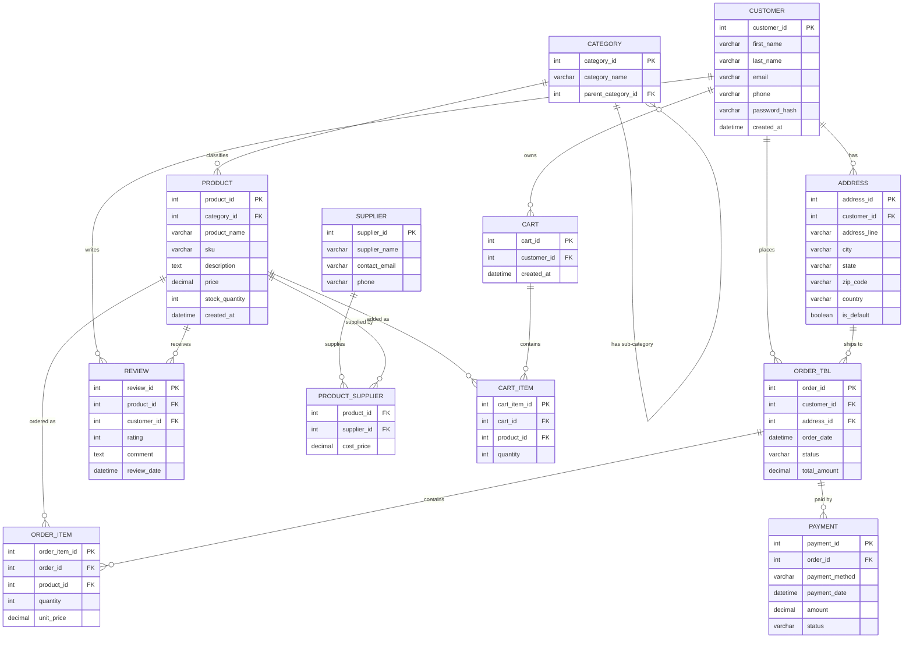

# E-Commerce Database Project

A complete database design project for an **Online E-Commerce Store**, covering ER modeling, relational schema design, normalization theory, and working MySQL scripts.

---

## 1. Project Overview

**Domain:** E-commerce (customers browse products, add them to a cart, place orders, pay, and leave reviews)

**Goal:** Design a normalized relational database that supports:
- Customer accounts and multiple shipping addresses
- Product catalog organized into categories, sourced from suppliers
- Shopping cart functionality
- Order placement with multiple line items
- Payment tracking
- Product reviews

**DBMS Target:** MySQL 8.0+

---

## 2. Entities and Their Attributes

| Entity | Description | Key Attributes |
|---|---|---|
| Customer | A registered shopper | customer_id (PK), name, email, phone |
| Address | A shipping/billing address, a customer can have several | address_id (PK), customer_id (FK) |
| Category | Product category, supports sub-categories | category_id (PK), parent_category_id (FK, self-referencing) |
| Supplier | Vendor that supplies products | supplier_id (PK) |
| Product | An item for sale | product_id (PK), category_id (FK) |
| Product_Supplier | Which suppliers provide which products, at what cost (M:N) | product_id (FK), supplier_id (FK) |
| Cart | A customer's active shopping cart | cart_id (PK), customer_id (FK) |
| Cart_Item | A product line inside a cart (M:N resolved) | cart_item_id (PK), cart_id (FK), product_id (FK) |
| Order | A placed order | order_id (PK), customer_id (FK), address_id (FK) |
| Order_Item | A product line inside an order (M:N resolved) | order_item_id (PK), order_id (FK), product_id (FK) |
| Payment | Payment made against an order | payment_id (PK), order_id (FK) |
| Review | A customer's review of a product | review_id (PK), product_id (FK), customer_id (FK) |

---

## 3. Entity-Relationship (ER) Diagram



> `ORDER_TBL` is used instead of `ORDER` because `ORDER` is a reserved SQL keyword.

**Relationship summary:**
- Customer (1) — (M) Address, Order, Cart, Review
- Category (1) — (M) Product; Category (1) — (M) sub-Category (self-referencing)
- Product (M) — (M) Supplier → resolved by `Product_Supplier`
- Cart (1) — (M) Cart_Item; Product (1) — (M) Cart_Item → resolves Cart–Product M:N
- Order (1) — (M) Order_Item; Product (1) — (M) Order_Item → resolves Order–Product M:N
- Order (1) — (M) Payment (supports partial/split payments)
- Product (1) — (M) Review; Customer (1) — (M) Review

---

## 4. Relational Schema

Notation: `Table(PK_underline, attr1, attr2, FK_attr → Referenced_Table)`

```
Customer(customer_id PK, first_name, last_name, email, phone, password_hash, created_at)

Address(address_id PK, customer_id FK → Customer, address_line, city, state, zip_code, country, is_default)

Category(category_id PK, category_name, parent_category_id FK → Category NULLable)

Supplier(supplier_id PK, supplier_name, contact_email, phone)

Product(product_id PK, category_id FK → Category, product_name, sku, description, price, stock_quantity, created_at)

Product_Supplier(product_id FK → Product, supplier_id FK → Supplier, cost_price, PK(product_id, supplier_id))

Cart(cart_id PK, customer_id FK → Customer, created_at)

Cart_Item(cart_item_id PK, cart_id FK → Cart, product_id FK → Product, quantity)

Order_Tbl(order_id PK, customer_id FK → Customer, address_id FK → Address, order_date, status, total_amount)

Order_Item(order_item_id PK, order_id FK → Order_Tbl, product_id FK → Product, quantity, unit_price)

Payment(payment_id PK, order_id FK → Order_Tbl, payment_method, payment_date, amount, status)

Review(review_id PK, product_id FK → Product, customer_id FK → Customer, rating, comment, review_date)
```

---

## 5. Normalization Walkthrough

To demonstrate *why* the schema looks the way it does, here's how a naive, unnormalized "Orders" table gets normalized step by step.

### Starting point — Unnormalized Table (UNF)

A single flat table combining order + customer + product info:

| order_id | cust_name | cust_email | products (name, qty, price) | address |
|---|---|---|---|---|
| 1 | Jane Doe | jane@mail.com | (Mouse,2,10), (Keyboard,1,25) | 12 Elm St |

Problem: the `products` column holds **repeating groups** (multiple values in one cell).

### 1NF — Eliminate repeating groups

Split repeating product info into separate rows, so every cell holds a single atomic value:

| order_id | cust_name | cust_email | product_name | qty | price | address |
|---|---|---|---|---|---|---|
| 1 | Jane Doe | jane@mail.com | Mouse | 2 | 10 | 12 Elm St |
| 1 | Jane Doe | jane@mail.com | Keyboard | 1 | 25 | 12 Elm St |

✅ Atomic values, no repeating groups.
❌ Still has redundancy: `cust_name`, `cust_email`, `address` repeat per row; the key is `(order_id, product_name)` but `cust_name`/`cust_email` depend only on `order_id`, not on the full key → **partial dependency**.

### 2NF — Remove partial dependencies

Applies when the primary key is composite. Split off attributes that depend on only *part* of the key:

**Order_Tbl**(order_id PK, cust_name, cust_email, address)
**Order_Item**(order_id FK, product_name, qty, price)

✅ No more partial dependency — `Order_Item` attributes now depend on the full key `(order_id, product_name)`.
❌ Still has a **transitive dependency**: in `Order_Tbl`, `address` (and if we'd kept it, city/zip) depends on the customer, not directly on `order_id`.

### 3NF — Remove transitive dependencies

Non-key attributes must depend **only** on the key, not on other non-key attributes. `cust_name`/`cust_email`/`address` really describe the *customer*, not the *order* — so they're pulled into their own table:

**Customer**(customer_id PK, cust_name, cust_email)
**Address**(address_id PK, customer_id FK, address)
**Order_Tbl**(order_id PK, customer_id FK, address_id FK)
**Order_Item**(order_item_id PK, order_id FK, product_id FK, qty, price)
**Product**(product_id PK, product_name, ...)

✅ This is essentially the final schema in Section 4 — every non-key attribute depends on "the key, the whole key, and nothing but the key."

### Why stop at 3NF?

The schema in Section 4 is in **3NF** (and satisfies **BCNF** — every determinant is a candidate key) for all tables. This is the standard target for transactional (OLTP) systems like an e-commerce store: it eliminates update/insert/delete anomalies while keeping queries reasonably simple. Going further to 4NF/5NF isn't needed here since there are no multi-valued or join dependencies beyond the M:N relationships already resolved by junction tables (`Product_Supplier`, `Cart_Item`, `Order_Item`).

---

## 6. Files in This Project

| File | Contents |
|---|---|
| `README.md` | This document — ER diagram, schema, normalization |
| `schema.sql` | DDL — `CREATE TABLE` statements with keys & constraints |
| `sample_data.sql` | DML — `INSERT` statements with sample rows |
| `queries.sql` | Example `SELECT` queries (joins, aggregates, subqueries) |

Run them in order: `schema.sql` → `sample_data.sql` → `queries.sql`.
